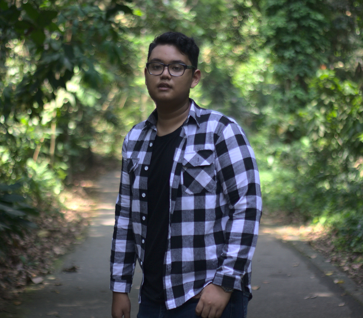

# About Me

## Who Am I?

Hi, my name is Danial Isyraf. I am a student at Singapore Polytechnics and I am currently taking <strong>Diploma in Engineering and Business</strong>. I am using this website as a blog to document my journey through the module <strong>EP1001 Further Digital Fabrication Prototyping Fundamentals</strong>. I will be sharing things I have learnt and also be sharing the assignments that I have done to put my learnings into the real world. I will also document the process that I took to complete my final project that I will be doing at the end of the semester. Wish me luck!  
