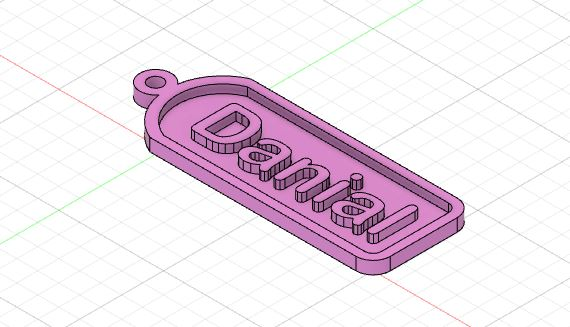
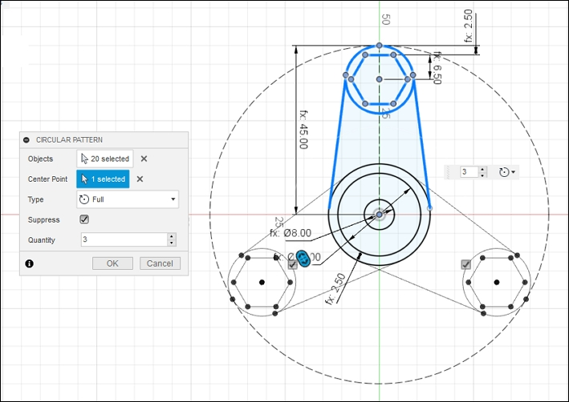
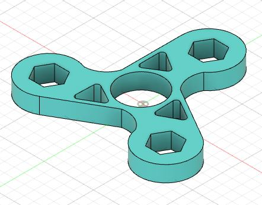

# 3D Modelling

I am going to do some 3D modelling exercises using <strong>Fusion 360</strong>

## 1st Exercise: Name Tag

I was given a plan to folllow and some specifications to design the name tag that looks like this:

These are the specifications given to me:

* The entire keytag should not exceed 30mm X 70mm, otherwise it will not fit into your pocket.
* The key ring hole must have a diameter of at least 2.5 mm with neck width of at least 3.5 mm for strength
* Do not make the keytag thicker than 4 mm

This is what I managed to design:

Here are the steps I took to get the final model:

1. Draw a rectangle with dimensions 20 x 50
2. Draw a construction line with length 6.66 horizontally from the mid-point of the breadth 
3. Draw a 3-point arc on the breadth of the rectangle with the third point at the end of the construction line
4. Add an offset of 2 mm for the rim
5. Draw 2 circles intersecting with the tip of the arc
6. Add your name, initials or identifying marks
7. Extrude the keytag 

## 2nd Exercise: Fidget Spinner 

For this exercise, I am going to design and model a fidget spinner. The fidget spinner will modelled off [ABEC 608 Bearing](https://www.skf.com/us/products/rolling-bearings/ball-bearings/deep-groove-ball-bearings/productid-608-Z) and [M8 Stainless Steel Hex Nuts](https://www.westfieldfasteners.co.uk/Metric-Nuts/Hex-Nut-M8-A2-Stainless.html) as the counterweights.

Here is the example of a figdet spinner model that was given to me:

Here is what I designed:

