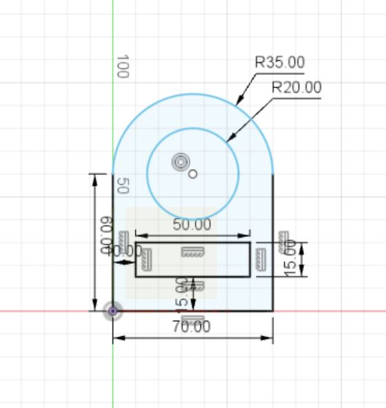
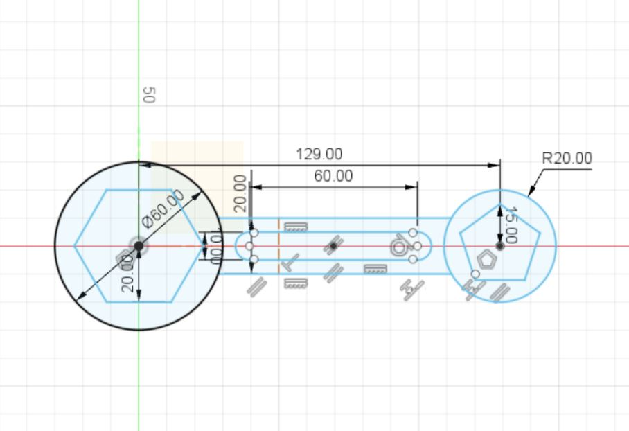
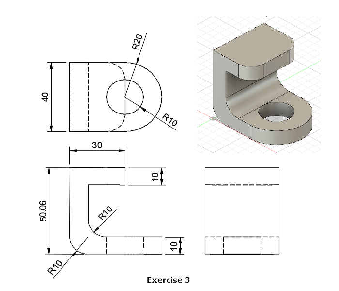
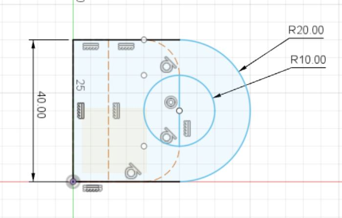
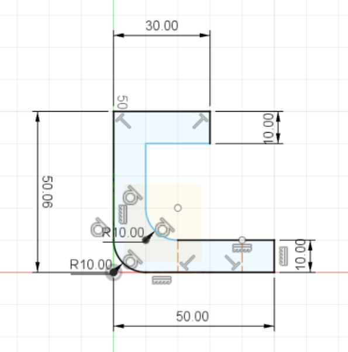
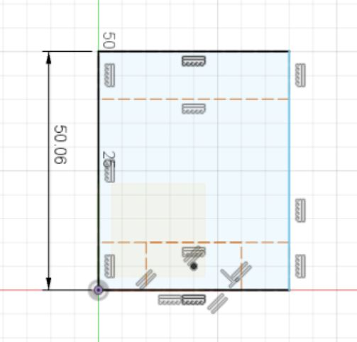

# Computer Aided Design (CAD)

## What is Computer Aided Design?

Computer Aided Design (CAD) or are a set of vector tools that allows you to create your design, simulate and analyse the results without actually building/fabricating the object. Once tested, you can then send the digital data for computer cutting or 3D printing.

I am going to be using Fusion 360. Fusion 360 is an Integrated CAD, CAM, and CAE software. You can consolidate your product development process. Unify design, engineering, electronics, and manufacturing into a single platform. I will be completing some exercises given to me using Fusion 360.

## Exercise 1: Simple Drawing

This is the the plan of the drawing that I need to complete:

 

This is what I got: 

This drawing was rather easy to achieve. I used the sketch rectangle and circle functions to draw out the shapes. 

## Exercise 2: More Drawing

In this exercise, I am going to do more drawing using more of the sketch functions and also some of the modify functions.

This is the drawing I managed to make:

## Exercise 3: Drawing and 3D 

In this exercise, I am going to draw the different views of an object and make it 3D

This is the top view that I drew

This is the side view

This is the front view

