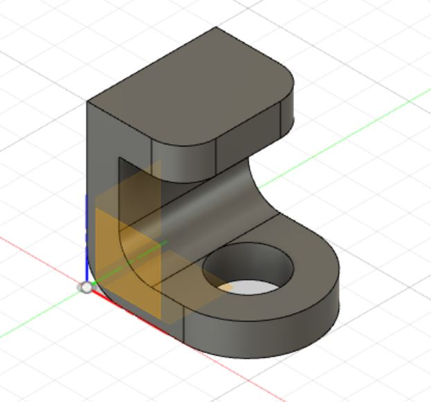

# Computer Aided Design (CAD)

## What is Computer Aided Design?

Computer Aided Design (CAD) or are a set of vector tools that allows you to create your design, simulate and analyse the results without actually building/fabricating the object. Once tested, you can then send the digital data for computer cutting or 3D printing.

I am going to be using Fusion 360. Fusion 360 is an Integrated CAD, CAM, and CAE software. You can consolidate your product development process. Unify design, engineering, electronics, and manufacturing into a single platform. I will be completing some exercises given to me using Fusion 360.

## Exercise 1: Simple Drawing

This is the the plan of the drawing that I need to complete:

 

This is what I got: 

This drawing was rather easy to achieve. I used the sketch rectangle and circle functions to draw out the shapes. Here are the steps I took:

*All dimensions are in mm*
1. Draw a 60 x 70 rectangle
2. Draw a circle with the diameter 75 on the breadth of the rectangle
3. Draw another circle with diameter 20 on the mid-point of the same breadth of before 
4. Draw a construction line from the mid-point of the breadth on the opposite side of the circles vertically up and set the length to 5
5. Draw a smaller center rectangle with dimensions 10 x 50 inside the first rectangle using the end of the line you made earlier
6. Delete all the contruction lines(dotted lines) 
7. Trim all the additional lines not needed according to the plan above

## Exercise 2: More Drawing

In this exercise, I am going to do more drawing using more of the sketch functions and also some of the modify functions.

This is the drawing I managed to make:

*All dimensions are in mm*
1. Draw a circle with diameter 60
2. Draw a line with length 129 from the center of the circle horizontally 
3. Draw a circle with dimeter 40 on the end of the line you made
4. Draw 2 lines from 1 circle to the other, ignoring if it intersects the circle
5. Dimension the gap between the 2 lines as set the distance to be 20
6. Trim away the parts of the lines that is inside the circles
7. Draw a construction line from the mid-point of one line to the other mid-point on the other line
8. Draw a 10 x 60 center rectangle from the mid-point of the construction line
9. Draw a circle with diameter 10 on each breadth of the rectangle
10. Trim the unwated part of the circle and rectangle away
11. Draw an circumscribed polygon with 6 side in the circle with diameter 60
12. Draw an inscribed polygon with 5 sides in the circle with diameter 40

## Exercise 3: Drawing and 3D 

In this exercise, I am going to draw the different views of an object and make it 3D

This is the top view that I drew

This is the side view

This is the front view

This is the what the final piece looks like. 

In order to achieve this:

1. Draw the side profile
2. Finish sketch and extrude by 40mm
3. Draw the top profile on the bottom of the piece
4. Extrude using negative values (-40mm) to remove material
5. Draw the top profile on the top of the piece
6. Extrude again using negative values (-40mm) to remove material