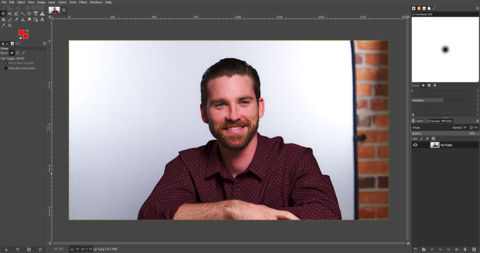
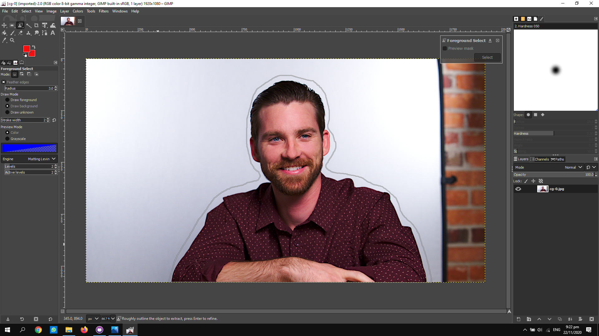
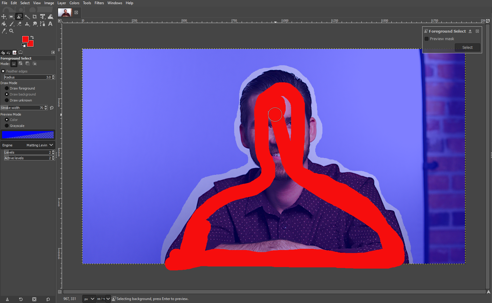
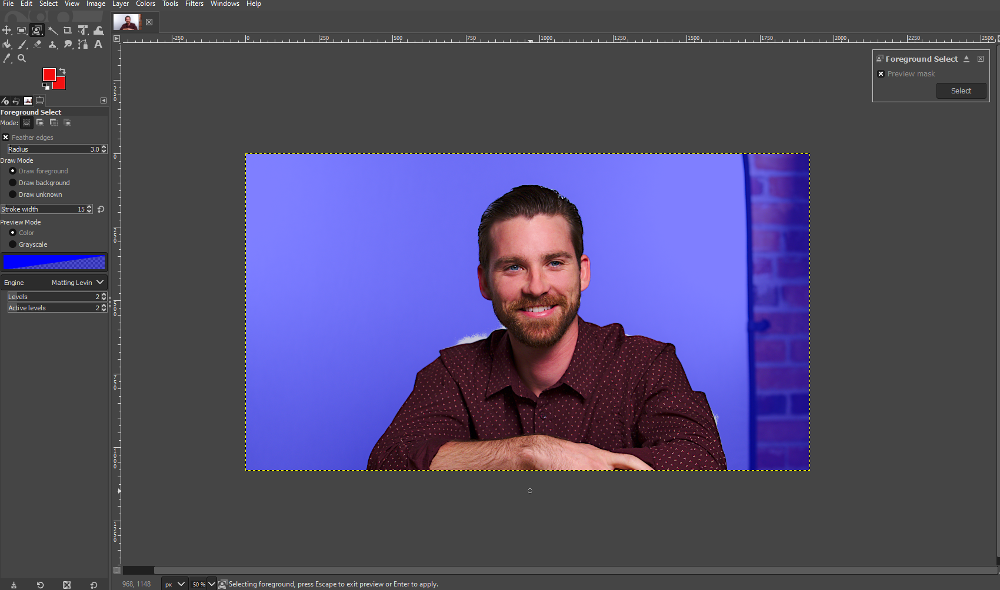
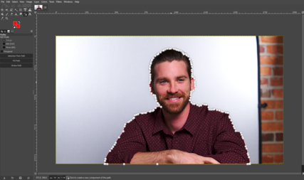
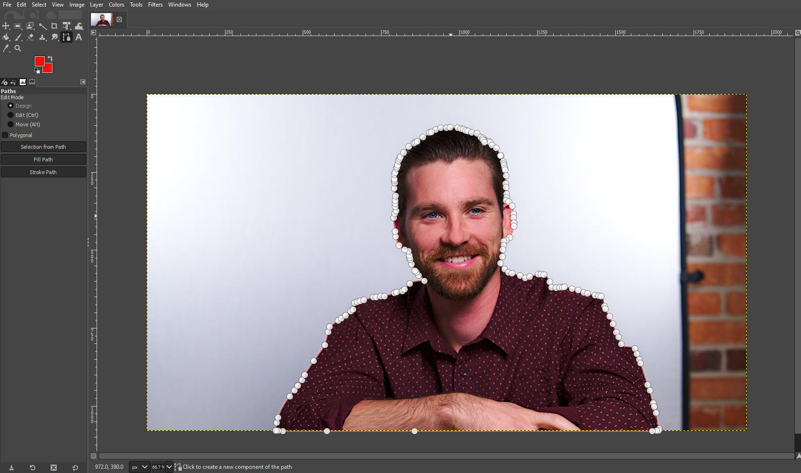
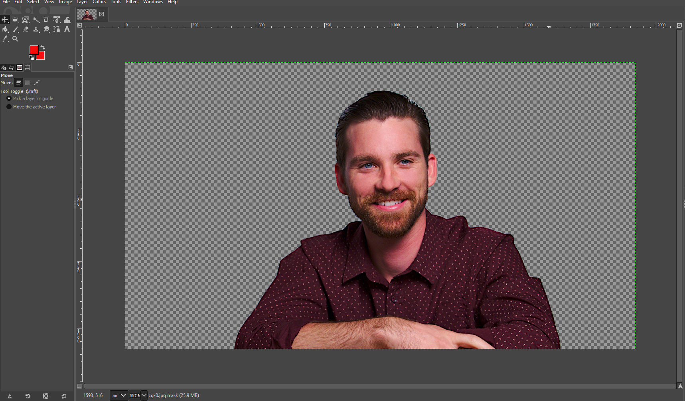
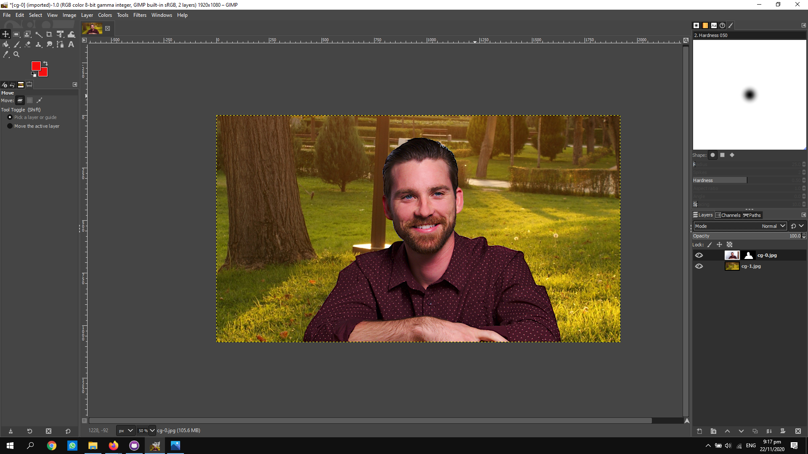

# Computer Graphics

Computer Graphics is divided into 2 categories:

| Raster | Vector |
|------- | ------ |
| Deals with pixels on screen |  Uses mathematical functions or algorithms to display images on the screen |
| Becomes fuzzy when zoomed/enlarged |  Stays clear when zoomed/enlarged |
| Used for photographs and image representation |  Used for  for logos, signs, fancy text and design files |

## GIMP

GIMP is a great software for raster images that is free and can do many things. I have never done any photoshop or photo manipulation. I will be trying to remove a background of a photo and replace it with another background. Here are the steps I took to achieve the final results.

1 .  Choose which photos you want to use. These are the 2 pictures that I will be using.

 
 

2 . Open the main image in GIMP

 

3 . Add an alpha layer & roughly trace the subject using the foreground select tool

*Press enter after tracing*

4 . Use the foreground select tool to paint over the subject as much as possible

 

5 . After painting the foreground, the image should now look this. There are still some parts of the background that needs to be corrected

6 .  There are still some parts of the background that needs to be corrected. Zoom in to the edges of the subject and use the foreground select tool to touch up the ports missed.

7 . Now, use the path tool to fix up the path around the subject

8 . Unselect the path to remove the background

9 .  Add your desired background into the layers (drag and drop)

This is what the final image should look like

