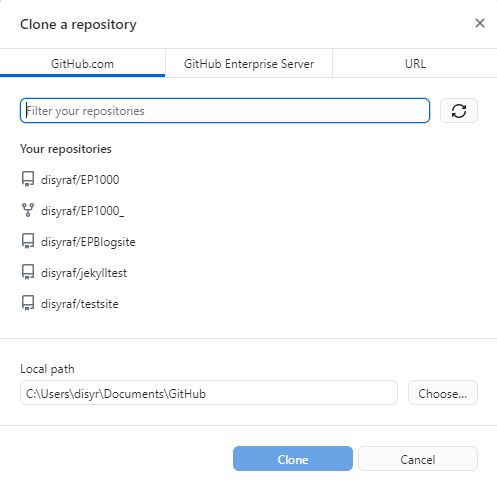
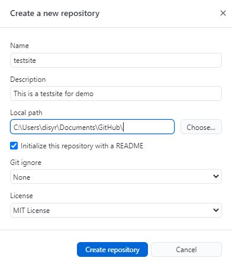
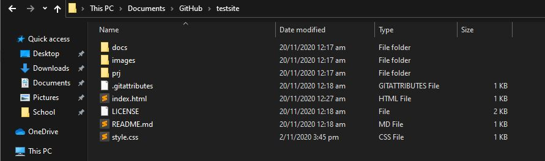
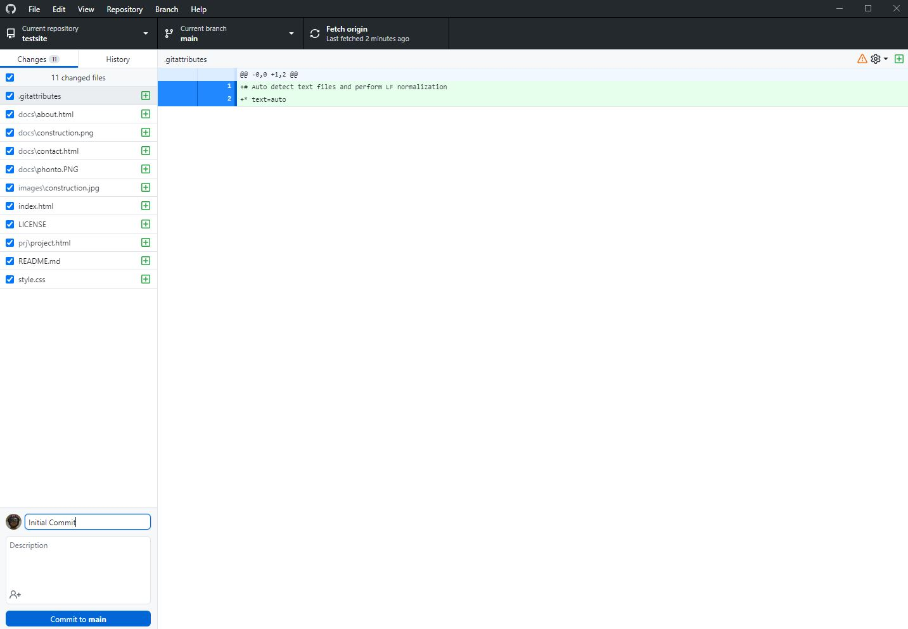
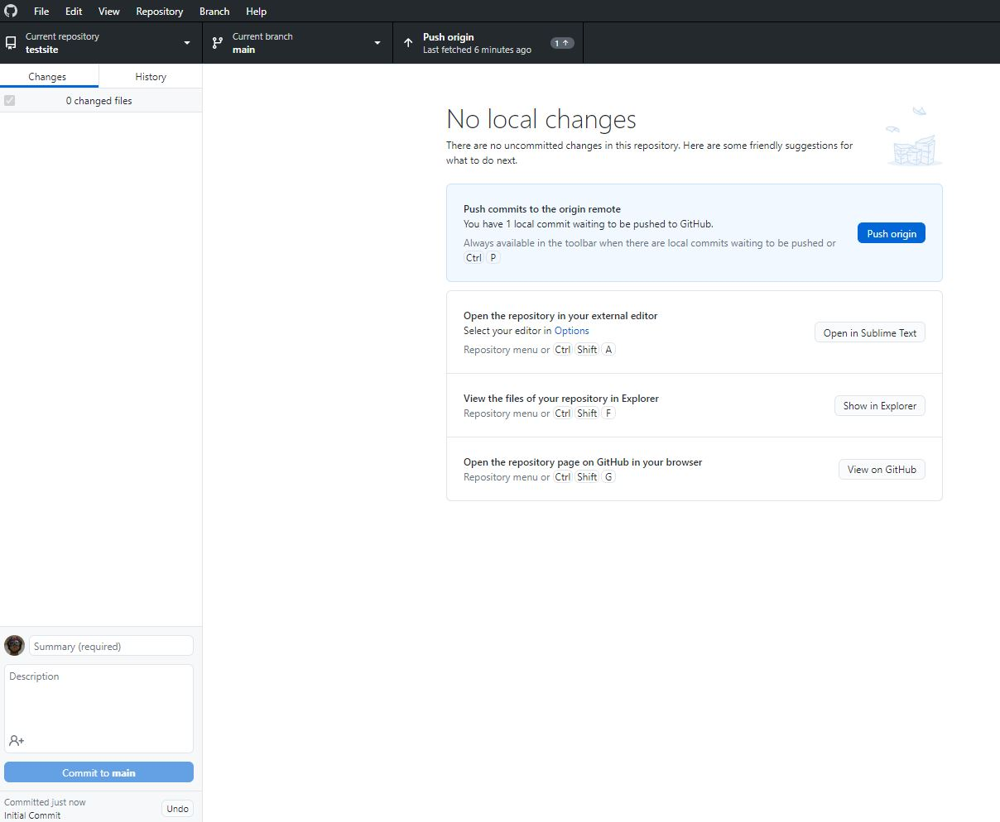
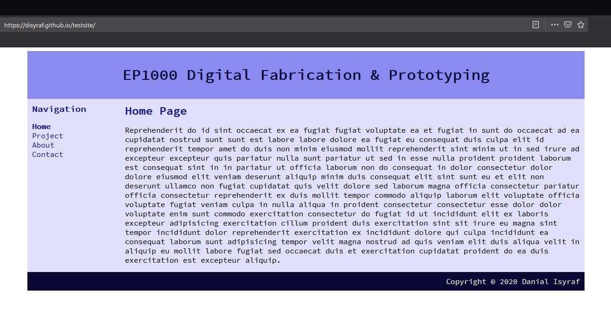
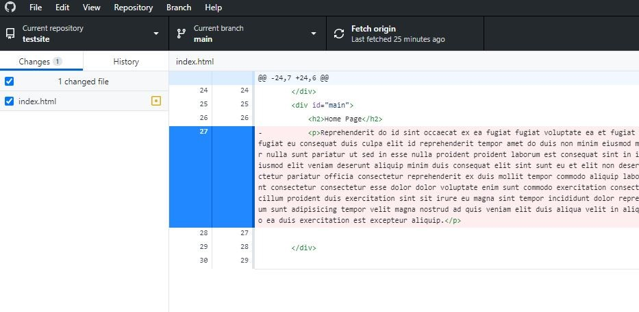
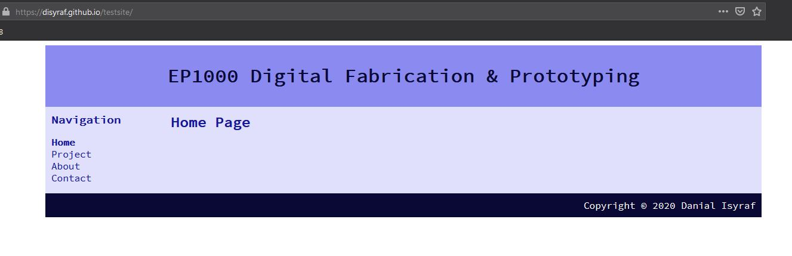
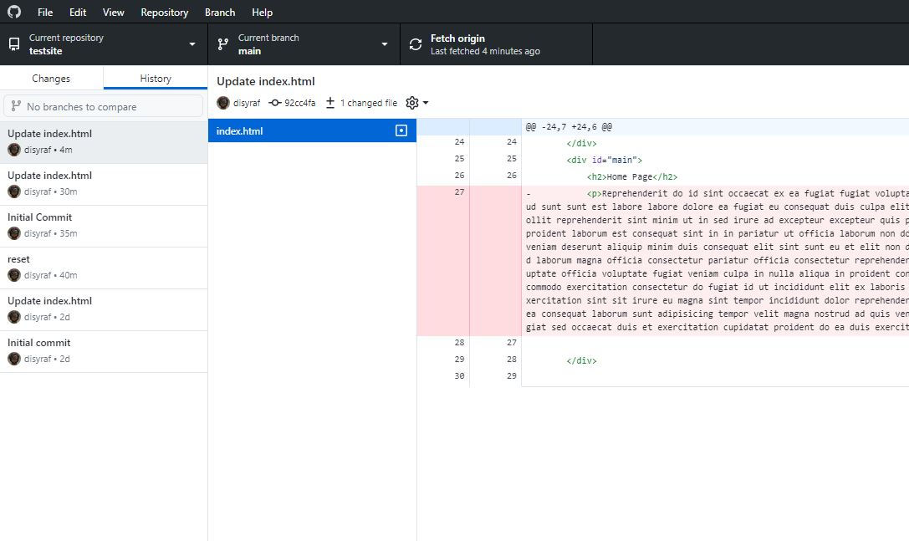
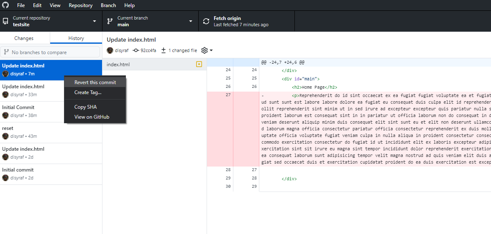

# GitHub & Version Control

## What is GitHub?
Git is a free and open-source distributed version control system. It is very easy to learn and provides good support for all projects regardless of size. It is also available for different Operating Systems (OS). A summary of the git commands are given in the table, it provides a reference of what we usually use.

| git command | Purpose |
| ----------- | ------- |
| Initialise  | Usually done only once to start the repository |
| git clone   |	Copies and downloads a repository to your local folder. Quick way of making a copy of an existing work. |
| git init    |	Initialises a local folder for git |
| git pull    |	Brings down a current version of the repository. | 
| git add *   |	Add any files to the staging area. This will pick up any files which have been updated/added/removed. |
| git status  |	Shows the files in staging area. |
| git commit  |	Moves the files from the staging area to the local repo. |
| git push | 	Copies the files from the local pc to the remote repo. |

In my case, I am using [GitHub Desktop](https://desktop.github.com/) to edit my repository locally. It allows me to view the changes made to my repositories and when and by who the changes made.

### Here are the steps to use GitHub Desktop:

1 . Clone a repository or make a new one

 
 

2 . Add all your files into the folder in your chosen local path

3 . Commit all the files to your main branch

*Button on the bottem left*

4 . Push to origin to upload the files to the repository

5 . Your Website should be uploaded now

## Version Control

One of the great reasons to use GitHub for your websites is that GitHub allows us to be able to have an easy method of version control. Version control is important as it makes safekeeping your work really easy. Here is how you version control with GitHub Desktop:

From the previous steps, I will delete the paragraph on the home page and show how to restore it with GitHub

1 . Delete the paragraph, commit to main  

2 . Push to origin and check updated website

3 . Go to GitHub Desktop and proceed to your repository's history tab

4 . Right-click the commit you want, revert and push to origin

Your website should be restored as just as mine did.
