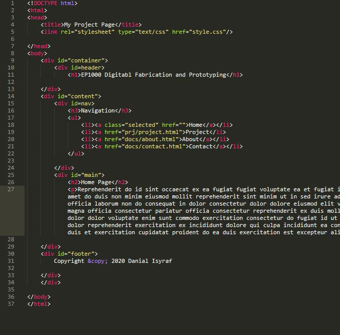
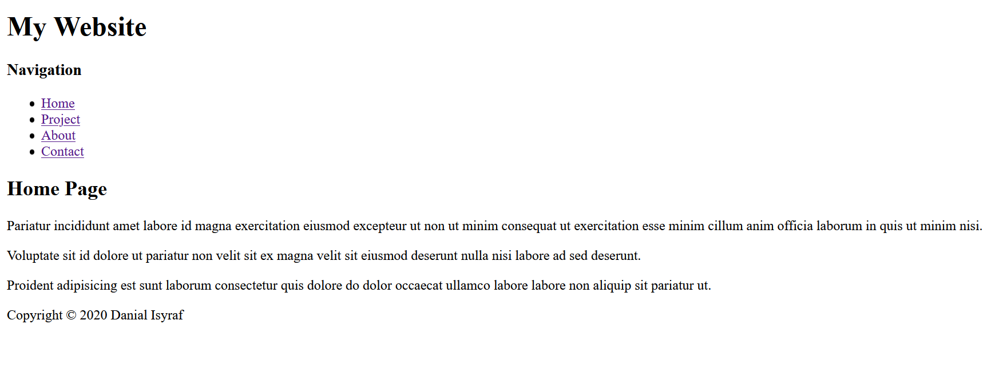
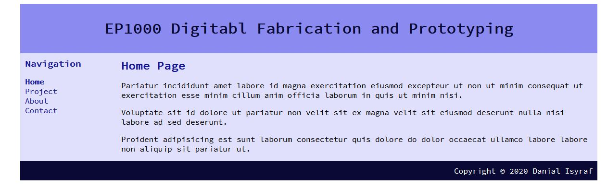
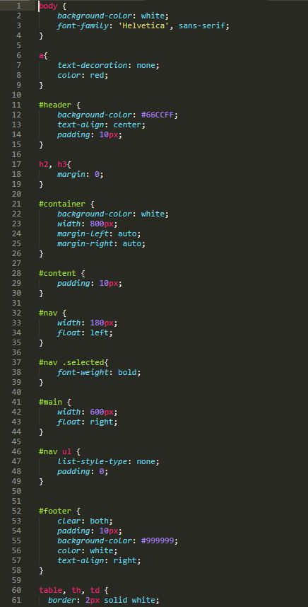

# Web Development
<strong>Web Developement</strong> is a part of EP1000. It is used as a form of documentation that is accessible anywhere and anytime. I was tasked to document my journey through this module and show my progress. 

## My First Website
I was tasked to build a website by following [Jake Wright's tutorial on CSS](https://www.youtube.com/watch?v=0afZj1G0BIE&feature=youtu.be). It is a pretty straightforward tutorial so here are some of the key steps to build a website:





### Pure HTML
After some simple steps of writing in <strong>HTML</strong>,
	
	

 I managed to get this basic website

### HTML and CSS
Next we have <strong>CSS</strong>. CSS is a stylesheet for the HTML site. It makes the site look a little more organised. From the video, I followed the steps to seperate some of the content on the page and also where to position them.

This is what a CSS code looks like:

And this is what the website looks like now with the CSS stylesheet file:

### More CSS
With more CSS, the website can look even better than before. This is how my website looks like with a little more CSS. I made the website to specifications given for the assignment.

