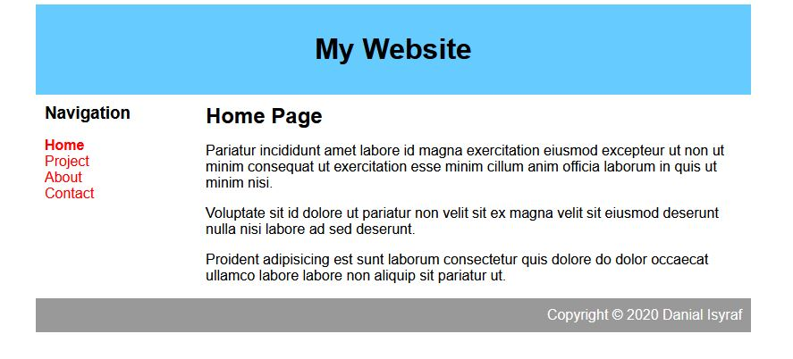

# Web Development
<strong>Web Developement</strong> is a part of EP1000. It is used as a form of documentation that is accessible anywhere and anytime. I was tasked to document my journey through this module and show my progress. 

## My First Website
I was tasked to build a website by following Jake Wright's tutorial on CSS. It is a pretty straightforward tutorial so here are some of the key steps to build a website:





### Pure HTML
After some simple steps of writing in <strong>HTML</strong>, I managed to get this basic website


<!DOCTYPE html>
<html>
<head>
	<title>My Project Page</title>
	
</head>
<body>
	

		

			<h1>My Website</h1>

	

	
	
		

			<h3>Navigation</h3>
			<ul>
				<li><a class="selected" href="">Home</a></li>
				<li><a href="docs/about.html">About</a></li>
				<li><a href="docs/contact.html">Contact</a></li>
			</ul>
			
		

		

			<h2>Home Page</h2>
			
Pariatur incididunt amet labore id magna exercitation eiusmod excepteur ut non ut minim consequat ut exercitation esse minim cillum anim officia laborum in quis ut minim nisi.

			
Voluptate sit id dolore ut pariatur non velit sit ex magna velit sit eiusmod deserunt nulla nisi labore ad sed deserunt.

			
Proident adipisicing est sunt laborum consectetur quis dolore do dolor occaecat ullamco labore labore non aliquip sit pariatur ut.
			
		

	

	

		Copyright &copy; 2020 Danial Isyraf
		
	

	

</body>
</html>
{% endhighlight %

### HTML and CSS
Next we have <strong>CSS</strong>. CSS is a stylesheet for the HTML site. It makes the site look a little more organised.

### More CSS
With more CSS, the website can look even better than before. This is how my website looks like with a little more CSS. I made the website to specifications given for the assignment.

